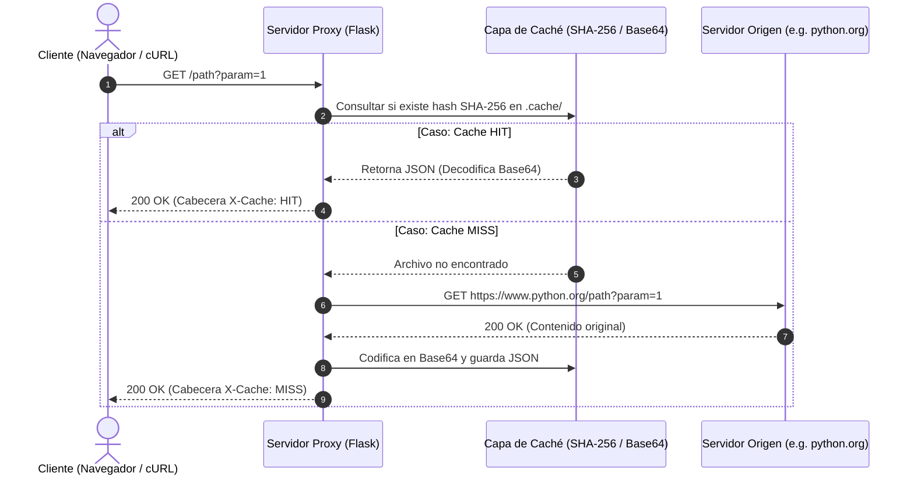

# ⚡ HTTP Proxy Caching Server

Español | [English](README.md)

Servidor proxy de almacenamiento en caché desarrollado en **Python con Flask y Requests**. Este servicio actúa como un intermediario entre el cliente y un servidor de origen, interceptando las peticiones HTTP para almacenar en caché las respuestas en el sistema de archivos local y reducir la latencia en peticiones subsecuentes.

Proyecto desarrollado siguiendo las especificaciones del desafío [roadmap.sh/projects/caching-server](https://roadmap.sh/projects/caching-server).

---

## ✨ Características Principales

* **🌐 Enrutamiento Dinámico:** Captura y redirige cualquier ruta (`/<path:path>`) y parámetros de consulta hacia el servidor de origen configurado.
* **📦 Caché Persistente Binaria:** Convierte las respuestas (incluyendo imágenes, CSS y binarios) a **Base64** y las almacena localmente en formato JSON dentro del directorio `.cache/`.
* **🔒 Hashes Deterministas (SHA-256):** Genera nombres de archivo únicos basados en la URL objetivo y los parámetros de consulta previamente ordenados, evitando duplicados.
* **🎯 Cabeceras de Diagnóstico `X-Cache`:** Añade automáticamente la cabecera HTTP `X-Cache: HIT` cuando la respuesta se sirve desde el almacenamiento local, y `X-Cache: MISS` cuando se consulta al origen.
* **🧹 Interfaz CLI Completa:** Permite iniciar el servidor configurando el puerto y origen objetivo, o ejecutar mantenimiento con la bandera `--clear-cache`.

---

## 📂 Estructura del Proyecto

```text
.
├── main.py        # Punto de entrada de la CLI y gestión de comandos
├── server.py      # Servidor Flask, definición de rutas y lógica del proxy
├── cache.py       # Serialización en Base64, hashing SHA-256 y lectura/escritura en disco
└── README.es.md   # Documentación del proyecto
```

---

## 🛠️ Tecnologías Utilizadas
* **Lenguaje:** Python 3.8+
* **Framework Web:** Flask
* **Cliente HTTP:** Requests
* **Módulos Estándar:** `hashlib`, `base64`, `json`, `argparse`, `shutil`

## 🚀 Instalación y Configuración
1. **Clonar el Repositorio e Instalar Dependencias**
```bash
  git clone https://github.com/Aki-new/proxy-cache.git
  cd proxy-cache

  # Crear y activar entorno virtual
  python -m venv .venv
  # En Windows:
  .venv\Scripts\activate
  # En macOS/Linux:
  source .venv/bin/activate

  # Instalar dependencias
  pip install flask requests
```

## 💡 Modo de Uso
1. **Iniciar el Servidor Proxy**
Inicia el proxy especificando la URL del servidor de origen y, opcionalmente, un puerto (por defecto `5000`):
```bash
  python main.py --port 3000 --origin https://www.python.org
```

2. **Probar el Funcionamiento de la Caché**
Realiza peticiones a tu servidor local a través de tu navegador o mediante `curl`:
**Primera Petición (MISS):**
```bash
  curl -i http://localhost:3000/
```
**Respuesta:** Retorna el contenido del origen e incluye la cabecera `X-Cache: MISS`.

**Segunda Petición (HIT):**
```bash
  curl -i http://localhost:3000/
```
**Respuesta:** Retorna instantáneamente la respuesta guardada en disco e incluye la cabecera `X-Cache: HIT`.

3. Borrar la Caché Persistente
Para eliminar la carpeta `.cache/` y todo su contenido almacenado:
```bash
  python main.py --clear-cache
```

## 📊 Diagrama de Secuencia


---

## ⚠️ Limitaciones Conocidas y Hoja de Ruta (Roadmap)

Este proyecto fue desarrollado como una **Prueba de Concepto (PoC)** funcional para validar la arquitectura de un servidor proxy de almacenamiento en caché. Actualmente presenta las siguientes limitaciones de diseño a considerar para entornos de producción:

* **Manejo de Memoria:** El contenido de las respuestas se carga de forma completa en memoria antes de serializarse a Base64, lo que limita el soporte para archivos de gran tamaño (videos/archivos grandes). 
  * *Mejora planeada:* Implementar manejo de *streams* (lectura/escritura por bloques).
* **Ausencia de TTL (Time To Live):** Los recursos en `.cache/` no expiran automáticamente ni respetan las cabeceras estándar `Cache-Control` o `ETag` del servidor origen.
  * *Mejora planeada:* Agregar un sistema de purga automatizada por tiempo y políticas LRU (*Least Recently Used*).
* **Serialización en Disco:** El almacenamiento de binarios en JSON vía Base64 incrementa el espacio en disco (~33%).
  * *Mejora planeada:* Guardar los archivos binarios crudos en el sistema de archivos y gestionar la metadatos/headers mediante SQLite o Redis.
* **Métodos HTTP:** Actualmente está optimizado para peticiones de lectura (`GET`).
