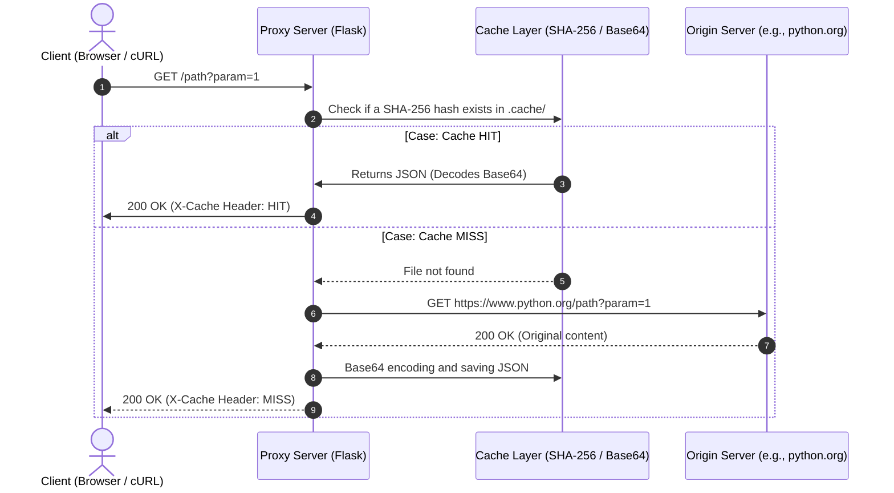

# ⚡ HTTP Proxy Caching Server

[Español](README.es.md) | English

A caching proxy server developed in **Python with Flask and Requests**. This service acts as an intermediary between the client and an origin server, intercepting HTTP requests to cache responses on the local file system and reduce latency on subsequent requests.

Project developed following the specifications of the challenge [roadmap.sh/projects/caching-server](https://roadmap.sh/projects/caching-server).

---

## ✨ Main Features

* **🌐 Dynamic Routing:** Captures and redirects any path (`/<path:path>`) and query parameters to the configured origin server.

* **📦 Binary Persistent Cache:** Converts responses (including images, CSS, and binaries) to **Base64** and stores them locally in JSON format within the `.cache/` directory.

* **🔒 Deterministic Hashes (SHA-256):** Generates unique filenames based on the target URL and pre-sorted query parameters, preventing duplicates.

* **🎯 Diagnostic Headers `X-Cache`:** Automatically adds the HTTP header `X-Cache: HIT` when the response is served from local storage, and `X-Cache: MISS` when querying the origin.

* **🧹 Full CLI Interface:** Allows you to start the server by configuring the target port and origin, or perform maintenance with the `--clear-cache` flag.

---

## 📂 Project Structure

```text
├── main.py # CLI entry point and command management
├── server.py # Flask server, route definition, and proxy logic
├── cache.py # Base64 serialization, SHA-256 hashing, and disk read/write
└── README.es.md # Project documentation
```

---

## 🛠️ Technologies Used
* **Language:** Python 3.8+
* **Web Framework:** Flask
* **HTTP Client:** Requests
* **Standard Modules:** `hashlib`, `base64`, `json`, `argparse`, `shutil`

## 🚀 Installation and Configuration
1. **Clone the Repository and Install Dependencies**
```bash
git clone https://github.com/Aki-new/proxy-cache.git
cd proxy-cache

# Create and activate virtual environment
python -m venv .venv

# On Windows:
.venv\Scripts\activate

# On macOS/Linux:
source .venv/bin/activate

# Install dependencies
pip install flask requests
```

## 💡 How to Use
1. **Start the Proxy Server**
Start the proxy by specifying the URL of the origin server and, optionally, a port (default is `5000`):
```bash

python main.py --port 3000 --origin https://www.python.org
```

2. **Test the Cache Functionality**
Make requests to your local server through your browser or using `curl`:
**First Request (MISS):**
```bash
curl -i http://localhost:3000/
```
**Response:** Returns the content of the source and includes the header `X-Cache: MISS`.

**Second Request (HIT):**
```bash
curl -i http://localhost:3000/
```
**Response:** Instantly returns the response saved to disk and includes the header `X-Cache: HIT`.


3. Clear the Persistent Cache
To delete the `.cache/` folder and all its stored contents:
```bash
python main.py --clear-cache
```

## 📊 Sequence Diagram


---

## ⚠️ Known Limitations and Roadmap

This project was developed as a functional **Proof of Concept (PoC)** to validate the architecture of a caching proxy server. Currently, it presents the following design limitations to consider for production environments:

* **Memory Management:** The content of responses is fully loaded into memory before being serialized to Base64, which limits support for large files (videos/large files).

* *Planned Improvement:* Implement stream handling (block read/write).

* **Lack of TTL (Time To Live):** Resources in `.cache/` do not automatically expire and do not respect the standard `Cache-Control` or `ETag` headers of the source server.

* *Planned Improvement:* Add an automated purge system based on time and LRU (Least Recently Used) policies.

* **Disk Serialization:** The storage
